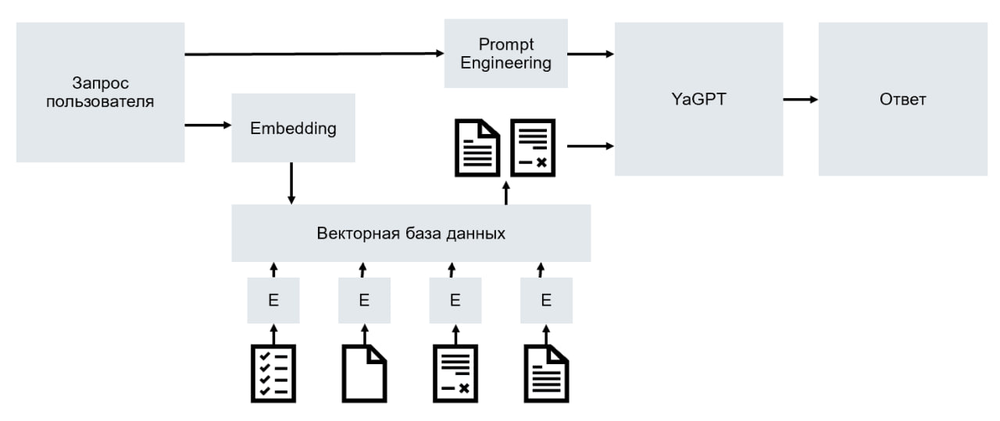

# Разговорный чат-бот для пассажиров РЖД

В последнее время, с появлением больших языковых разговорных моделей 
(Large Language Models, LLM), таких, как Yandex GPT, актуальным становится вопрос 
создания предметно-ориентированных чат-ботов, т.е. таких разговорных чат-ботов, которые 
способны поддерживать беседу в рамках какой-то узкой предметной области. В итоге мы решили 
сконцентрироваться на железнодорожной отрасли, для которой и будем разрабатывать такого чат-бота.

## Этапы работы
  
Вся работа состоит из следующих основных этапов:

* [Анализ предметной области](#анализ-предметной-области)
* [Сбор датасета](#сбор-датасета) 

На данном этапе требуется собрать и подготовить данные, необходимые для обучения и работы чат-бота. 
> Существуют различные подходы к сбору и подготовке данных, но в рамках данной работы 
      наиболее подходящим является использование текстового датасета, чанкинга и эмбеддингов.
* [Реализация](#реализация)
  * [Установка библиотек и импорт модулей](#установка-библиотек-и-импорт-модулей)
  * [Загрузка данных из папки data](#загрузка-данных-из-папки-data)
  * [Разработка архитектуры чат-бота](#разработка-архитектуры-чат-бота)
  * [Retrieval-Augmented Generation (RAG)](#retrieval-augmented-generation)

На данном этапе происходит исследование и внедрение Retrieval-Augmented Generation (RAG), который представляет 
собой инновационный подход к работе с языковыми моделями. 
> Суть его заключается в том, что помимо вопроса пользователя, мы программно 
> подбираем и включаем в контекст дополнительную информацию из различных внешних источников. Это позволяет создать более глубокий и 
> информативный запрос для языковой модели, что в конечном итоге способствует формированию более полных и точных ответов. Такой подход 
> улучшает качество взаимодействия с пользователем, предоставляя ему более ценные и релевантные ответы.
  * [Yandex API Расписаний](#yandex-api-расписаний)

На данном этапе происходит исследование Yandex API Расписаний и его интеграция с RAG.
> Через бесплатный API Яндекс.Расписаний можно получать данные сервиса для любого вида транспорта.
  * [Написание чат-бота](#написание-чат-бота)
  * [Тестирование и оценка](#тестирование-и-оценка)

На этапе тестирования необходимо оценить качество и эффективность обученной языковой модели. 
> Для этого можно использовать различные подходы, но наиболее подходящими в рамках данной 
> работы являются использование пар вопрос-ответ (QA) и вопросов из раздела FAQ сайта РЖД.

## Пошаговая инструкция

### Анализ предметной области

Тут должен быть анализ.

### Сбор датасета
Процесс сбора данных с **[веб-сайта](https://www.rzd.ru/)** включает в себя ряд технических этапов, 
начиная с извлечения информации о расписаниях поездов, статусах отправлений, билетных ценах и заканчивая другими связанными с РЖД данными. 

Полученные данные направляются на этап обработки с использованием специализированных инструментов, таких как **[Gemini](https://gemini.google.com/?hl=ru)** или **[Claude](https://www.anthropic.com/claude)**. 

> Эти инструменты предназначены для автоматического анализа текста и его классификации на более мелкие единицы (т.е. данные инструменты помогают 
уменьшенить объема текста с без потери смысла, а именно: удалить из текста излишние слова, фразы или абзацы, сохраняя 
при этом основную информацию и ключевые концепции). Такой подход позволяет улучшить качество данных и сделать их более компактными 
для последующей работы.

Подготовленные данные сохраняются в текстовые файлы формата 
TXT, который является универсальным форматом хранения текстовой информации.

### Реализация

#### Установка библиотек и импорт модулей

```jupyter
%pip install langchain sentence_transformers==2.5.1 lancedb==0.6.0 unstructured==0.12.5 yandex_chain==0.0.7 yandexcloud==0.262.0
%pip install langchain==0.1.0

import os
folder_id = os.environ['folder_id'] # secret folder_id from environment variables
api_key = os.environ['api_key']

import pandas as pd
import numpy as np
import seaborn as sns

import matplotlib.pyplot as plt
import langchain
import langchain.document_loaders
import langchain.text_splitter as sp
from yandex_chain import YandexEmbeddings
import lancedb
```
#### Загрузка данных из папки data

```jupyter
source_dir = "data"
loader = langchain.document_loaders.DirectoryLoader(source_dir, glob="*.txt", show_progress=True, recursive=True)
```

#### Разработка архитектуры чат-бота


#### [Retrieval-Augmented Generation](https://habr.com/ru/articles/772130/)

Тут должен быть RAG.

#### [Yandex API Расписаний](https://yandex.ru/dev/rasp/raspapi/)

Теперь перейдем к работе с *Yandex API Расписаний*. 

В начале импортируем необходимые модули: **datetime** для работы с *датой* и *временем*, **json** для работы с данными формата *JSON,* **requests** для отправки *HTTP запросов*.
```jupyter
import datetime
import json
import requests
```

Далее определим переменную **rasp_api_url**, содержащую *URL API*, и переменную **rasp_api_key**, в которой будет хранится *ключ для доступа к API*.
```jupyter
rasp_api_url = 'https://api.rasp.yandex.net/v3.0/'
rasp_api_key = os.environ['rasp_api_key']
```

Теперь создадим переменную, хранящую сообщение об ошибке, возникающей при обработке данных. 
```jupyter
error_message = 'Ошибка при обработке данных. Попробуйте сделать запрос еще раз!'
```

*Необходимые функции:* 
1. ```make_request``` Эта функция отправляет HTTP запрос к API Yandex Расписаний и возвращает результат в формате JSON.
2. ```get_city_code``` Эта функция принимает на вход название населенного пункта и возвращает его код в соответствии с API Yandex Расписаний.
3.  ```get_routes``` Эта функция ищет маршруты от одного населенного пункта к другому. Она использует API Yandex Расписаний для поиска маршрутов, фильтрует результаты и возвращает информацию о маршрутах.
4. ```get_routes_by_date``` Эта функция аналогична get_routes, но позволяет искать маршруты по указанной дате.

> Реализацию вышеуказанных функций можно посмотреть в файле (ссылка на файл в git)


#### Написание чат-бота

На данной стадии мы первым делом выполним установку пакетов **telebot** и **requests** через утилиту управления пакетами **pip**.
```jupyter
%pip install telebot requests
```

Следующим шагом пропишем строки, которые импортируют необходимые *модули* для работы с **Telegram API** через библиотеку **telebot**.
```jupyter
import telebot
from telebot import types
```

Загрузим *ключ API бота* из переменной окружения **telebot_api_key**.
```jupyter
import os
telebot_api_key = os.environ['telebot_api_key']
```

Создадим *экземпляр* бота с использованием загруженного *ключа API*.
```jupyter
bot = telebot.TeleBot(telebot_api_key)
```

Определяем *кнопки* клавиатуры, которые будут использоваться для взаимодействия с пользователем.
```jupyter
api_button = types.KeyboardButton('📓 Режим API')
ai_button = types.KeyboardButton('🤖 Режим AI')
home_button = types.KeyboardButton('🏠 Вернуться на главную')
back_button = types.KeyboardButton('🔙 Вернуться назад')
delete_button = types.KeyboardButton('🗑 Очистить чат')
```

Далее прописываем *обработчики* для кнопок и обработчик для команды ```/start```.
Можно посмотреть в файле (ссылка на файл в git)

Следущим шагом запускаем бота.

#### Тестирование и оценка

# Команда проекта

* [Брежнева Алена](https://github.com/alenka192003)
* [Васильев Владимир](https://github.com/SilentMiver) 
* [Дьяченко Юрий](https://github.com/YurDuiachenko)
* [Замуруев Роман](https://github.com/Zamuruev)
* [Карпушин Андрей](https://github.com/recwayer)
* [Левшенко Денис](https://github.com/kottzi)