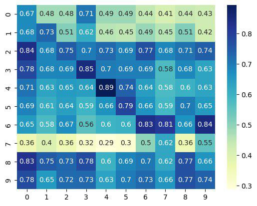
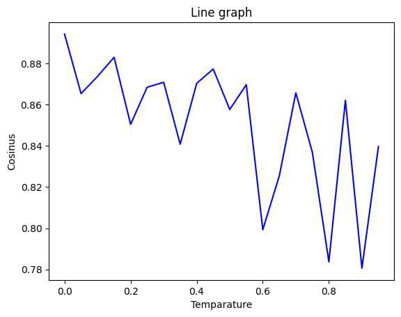

# Разговорный чат-бот для пассажиров РЖД

В последнее время, с появлением больших языковых разговорных моделей
(Large Language Models, LLM), таких, как Yandex GPT, актуальным становится вопрос
создания предметно-ориентированных чат-ботов, т.е. таких разговорных чат-ботов, которые
способны поддерживать беседу в рамках какой-то узкой предметной области. В итоге мы решили
сконцентрироваться на железнодорожной отрасли, для которой и будем разрабатывать такого чат-бота.

## Технологии
В основе [чат-бота](https://github.com/yandex-datasphere/yatalks-potter-bot) использовалась технология [RAG(Retrieval-Augmented Generation)](https://github.com/yandex-datasphere/yatalks-potter-bot) при комбинации библиотек [LangChain](https://www.langchain.com/) и [YandexChain](https://github.com/yandex-datasphere/yandex-chain), для эмбедингов использовались YandexEmbedings, в качестве векторного хранилища был выбран [LanceDB](https://lancedb.com/), в качестве основного LLM - **YandexGPT** (хотя и были неудачные попытки построить работу на HuggingFace).
[API Яндекс.Расписаний](https://yandex.ru/dev/rasp/raspapi/) было использовано для получения актуальной инофрмации о поездах и маршрутах.
**Telebot API** помог в написании обёртки чат-бота в телеграм бота.

## Этапы работы

* [Сбор и подготовка данных](#сбор-и-подготовка-данных)
* [Подготовка проекта](#подготовка-проекта)
* [Retrieval-Augmented Generation (RAG)](#retrieval-augmented-generation)
* [Yandex API Расписаний](#yandex-api-расписаний)
* [Телеграм-бот](#телеграм-бот)
* [Тестирование и оценка](#тестирование-и-оценка)

### Сбор и подготовка данных
Процесс сбора данных с **[веб-сайта](https://www.rzd.ru/)** включает в себя ряд технических этапов,
начиная с извлечения информации о расписаниях поездов, статусах отправлений, билетных ценах и заканчивая другими связанными с РЖД данными.

Полученные данные направляются на этап обработки с использованием специализированных инструментов, таких как **[Gemini](https://gemini.google.com/?hl=ru)** или **[Claude](https://www.anthropic.com/claude)**.

Эти инструменты предназначены для автоматического анализа текста и его классификации на более мелкие единицы (т.е. данные инструменты помогают
уменьшенить объема текста с без потери смысла, а именно: удалить из текста излишние слова, фразы или абзацы, сохраняя
при этом основную информацию и ключевые концепции). Такой подход позволяет улучшить качество данных и сделать их более компактными
для последующей работы.

Подготовленные данные сохраняются в текстовые файлы формата
TXT, который является универсальным форматом хранения текстовой информации.

### Подготовка проекта

#### Установка библиотек

```bash
pip install langchain==0.1.0 sentence_transformers==2.5.1 lancedb==0.6.0 unstructured==0.12.5 yandex_chain==0.0.7 yandexcloud==0.262.0
pip install telebot requests
```

#### Импорт модулей

```
import pandas as pd
import numpy as np
import seaborn as sns
import matplotlib.pyplot as plt
import langchain
import langchain.document_loaders
import langchain.text_splitter as sp
from yandex_chain import YandexEmbeddings
import lancedb
import telebot
import datetime
import json
import requests
```

#### Получение ключей из окружения

```
rasp_api_key = os.environ['rasp_api_key']
telebot_api_key = os.environ['telebot_api_key']
```
где:
* ```telebot_api_key``` - используется для получения доступа к API мессенджера Telegram, чтобы создать или настроить телеграм-бота. Этот ключ обычно используется для аутентификации и авторизации бота в системе 
Telegram, что позволяет боту отправлять и получать сообщения от пользователей.
* ```rasp_api_key``` - используется дла получения доступа к Yandex API Расписаний.

### Retrieval-Augmented Generation

Подход с увеличением извлечения **(RAG)** позволяет дополнять запросы пользователей релевантной информацией из внешних источников данных, таких как текстовые документы или базы знаний. 
Это достигается путем поиска и извлечения релевантных фрагментов текста **(чанков)** с использованием **эмбеддингов** и их последующей подачи на вход языковой модели вместе с запросом пользователя. 
Таким образом, модель получает дополнительный контекст, что повышает **качество** и **точность** ее ответов.

Для начала документ разбиваем на небольшие фрагменты размером *chunk_size*.
```jupyter
chunk_size = 1024 # Размер фрагмента
chunk_overlap = 50 # Перекрытие между фрагментами
splitter = sp.RecursiveCharacterTextSplitter(chunk_size=chunk_size, chunk_overlap=chunk_overlap)
fragments = splitter.create_documents([x.page_content for x in loader.load()])
```
Считываем по фрагментам текста векторные эмбеддинги с помощью *Yandex GPT Embedding API*.
```jupyter
from yandex_chain import YandexEmbeddings
embeddings = YandexEmbeddings(folder_id=folder_id, api_key=api_key)
for fragment in fragments:
    fragment.embedding = embeddings.embed_query(fragment.page_content)
```

Создаём векторную базу данных, обрабатываем все фрагменты и сохраняем их.
```jupyter
db_dir = "store" # Директория для хранения БД
os.makedirs(db_dir, exist_ok=True)
db = lancedb.connect(db_dir)
table = db.create_table(
    "vector_index",
    data=[
        {"vector": fragment.embedding, "text": fragment.page_content, "id": fragment.metadata['id']} for fragment in fragments
    ],
    mode="overwrite",
)
```
Извлекаем релевантные фрагменты по запросу.

Пишем адаптер для *LangChain* для работы с моделью *Yandex GPT*. 
```jupyter
from langchain.llms import YandexGPT

# Создание адаптера для LangChain
instructions = """
Ты умный ассистент, который отвечает на сообщения пользователя и вопросы про РЖД.
Ты анализируешь запросы пользователя и предоставленный текст, но не упоминаешь о них в своем ответе!
Если пользователь СПРАШИВАЕТ ЧТО-ТО СВЯЗАННОЕ с РЖД и железными дорогами в целом, то ответь пользователю максимально информативно.
Если пользователь СПРАШИВАЕТ ЧТО-ТО НЕ СВЯЗАННОЕ с РЖД и железными дорогами в целом или в данных НЕТ ответа на его вопрос, тогда ПРОИГНОРИРУЙ ДАННЫЕ и ответь пользователю на интересующий его запрос.
"""
llm = YandexGPT(api_key=api_key, instruction_text=instructions, folder_id=folder_id, use_lite=False, temperature=0)

```
Убеждаемся, что *Yandex GPT* работает.

### Yandex API Расписаний

Теперь перейдем к работе с *Yandex API Расписаний*.

Теперь создадим переменную, хранящую сообщение об ошибке, возникающей при обработке данных.
```jupyter
error_message = 'Ошибка при обработке данных. Попробуйте сделать запрос еще раз!'
```

*Необходимые функции:*
1. ```make_request``` - эта функция отправляет HTTP запрос к API Yandex Расписаний и возвращает результат в формате JSON.
2. ```get_city_code``` - эта функция принимает на вход название населенного пункта и возвращает его код в соответствии с API Yandex Расписаний.
3.  ```get_routes``` - эта функция ищет маршруты от одного населенного пункта к другому. Она использует API Yandex Расписаний для поиска маршрутов, фильтрует результаты и возвращает информацию о маршрутах.
4. ```get_routes_by_date``` - эта функция аналогична get_routes, но позволяет искать маршруты по указанной дате.

> Для эффективной работы с данными Yandex API Расписаний необходимо уметь формировать правильные запросы, обрабатывать полученные данные и адаптировать их для своих потребностей.
> Давайте подробнее рассмотрим этапы работы с данными этого API.

*Пример работы с данными:*

* Формирование запроса: 
```
   def make_request(endpoint, request):
   link = rasp_api_url + endpoint + rasp_api_key + request
   response = requests.get(link)
   return json.loads(response.text)

```

* Получение ответа от API в формате JSON:
```
from_location = 'Москва'
to_location = 'Санкт-Петербург'
date = '2024-05-20'  # Дата отправления

request = f'&from={get_city_code(from_location)}&to={get_city_code(to_location)}&date={date}'
response = make_request('search', request)

```

* Обработка полученного JSON, извлечение информации о маршрутах:
```
try:
    segments = response["segments"]
    for segment in segments:
        # Обработка информации о маршруте
except Exception:
    print("Ошибка при обработке JSON.")

```

* Адаптация данных при необходимости:
```
# Преобразования времени отправления и прибытия в удобный формат
departure_time = datetime.datetime.strptime(segment["departure"], "%H:%M:%S").time()
arrival_time = datetime.datetime.strptime(segment["arrival"], "%H:%M:%S").time()

```

### Телеграм-бот

Создадим *экземпляр* бота с использованием загруженного *ключа API*.
```jupyter
bot = telebot.TeleBot(telebot_api_key)
```

Напишем обработчик для команды ```/start```. 
```
@bot.message_handler(commands=['start'])
def start(message):
    bot.send_message(message.chat.id,
                     'Привет! Я - Чат-Бот РЖД. 🚂\n'
                     'Твой персональный помощник, который хранит информацию о РЖД :)\n'
                     'Можете задавать мне любые вопросы, и я постараюсь на них ответить!\n')

```

Следом за ним обрабочик для входящих сообщений, 

```
@bot.message_handler(func=lambda message: True)
def handle_message(message):
    ai_response = GPT(message.text)
    bot.send_message(message.chat.id, ai_response)

```
где функция ```handle_message``` принимает *запрос* пользователя, далее функция ```GPT``` обрабатывает переданный *запрос*, 
возращает ответ и записывает его в пемерменную ```ai_response```, после чего отправлет ответ пользователю с помощью метода ```bot.send_message```.

Следущим шагом запускаем бота ```bot.polling(none_stop=True)```.

### Тестирование и оценка

В данном разделе мы сосредоточимся на двух ключевых методах оценки и совершенствования нашей модели: **матрице косинусного сходства** 
и **зависимости косинусного сходства от "температуры"**.

> Матрица косинусного сходства предоставляет нам возможность количественно измерить сходство ответов, выдаваемых чат-ботом с информацией, представленной на сайте РЖД.

Матрица косинусного сходства на *10 FAQ*:



В нашем случае мы получили высокий показатель косинусного сходства, что свидетельствует о высоком качестве модели.

Далее, мы рассматриваем зависимость косинусного сходства от "температуры".

> Она показывает, как наша модель адаптируется к различным стилям общения. "Температура" в данном случае является метафорой, 
которая регулирует степень сходства между нашими ответами и ответами с сайта РЖД.

Зависимость косинусного сходства от *температуры*:



Анализ зависимости косинусного сходства от температуры позволяет нам сделать вывод, что модель способна генерировать ответы, которые соответствуют ожиданиям пользователей,
даже если эти ответы часично не совпадают с информацией на сайте РЖД.

При температуре от 0 до 0.5 модель демоснтрирует высокую степень сходства. По мере ее увеличения сходство снижается, модель начинает генерировать более 
свободные и творческие варианты.

## Команда проекта

* [Брежнева Алена](https://github.com/alenka192003)
* [Васильев Владимир](https://github.com/SilentMiver)
* [Дьяченко Юрий](https://github.com/YurDuiachenko)
* [Замуруев Роман](https://github.com/Zamuruev)
* [Карпушин Андрей](https://github.com/recwayer)
* [Левшенко Денис](https://github.com/kottzi)

## Источники

* [Retrieval-Augmented Generation](https://habr.com/ru/articles/772130/)
* [Yandex API Расписаний](https://yandex.ru/dev/rasp/raspapi/)
* [PromptEngineering4Devs](https://github.com/yandex-datasphere/PromptEngineering4Devs)
* [Создаём вопрос-ответного чат-бота (potter-bot)](https://github.com/yandex-datasphere/yatalks-potter-bot)
* [Yandex-chain](https://github.com/yandex-datasphere/yandex-chain)
* [Оцениваем RAG-пайплайны](https://habr.com/ru/articles/778166/)
* [Добавление собственных данных в LLM с помощью RAG](https://habr.com/ru/companies/wunderfund/articles/779748/)